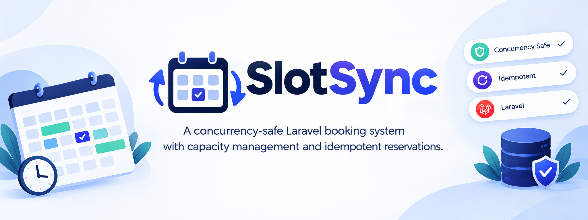
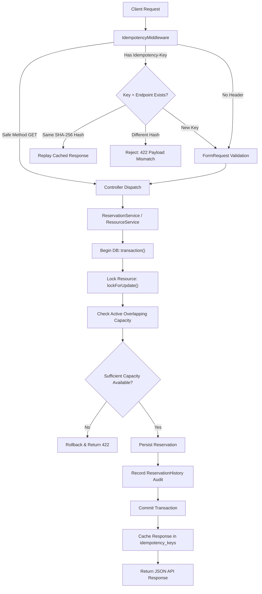
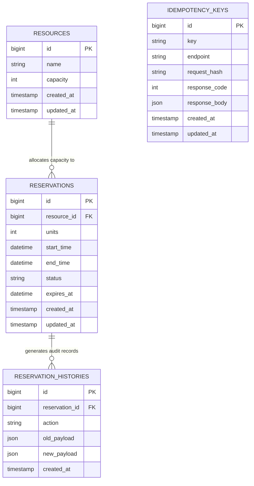
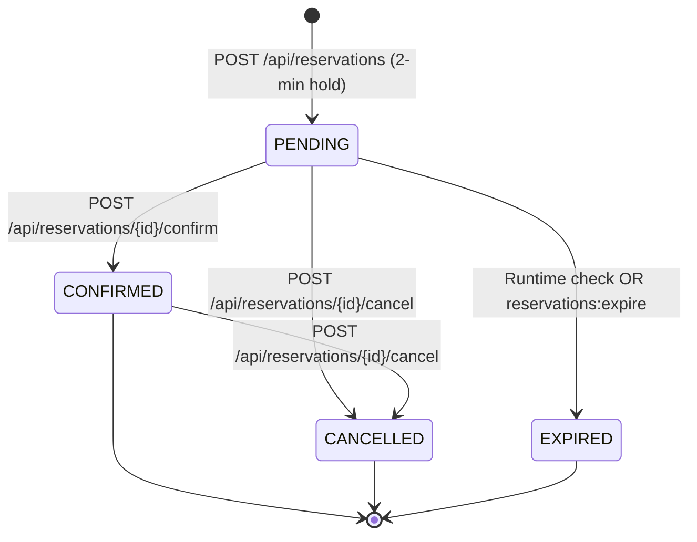
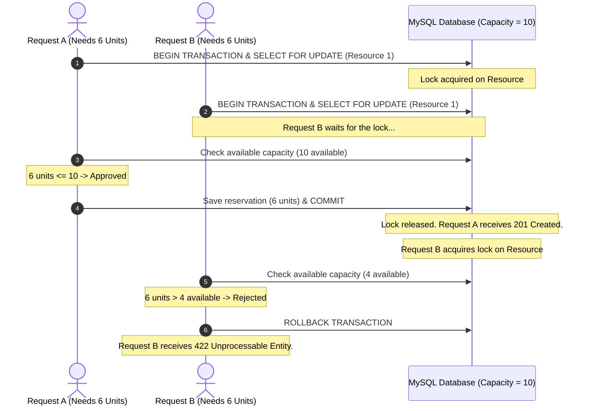
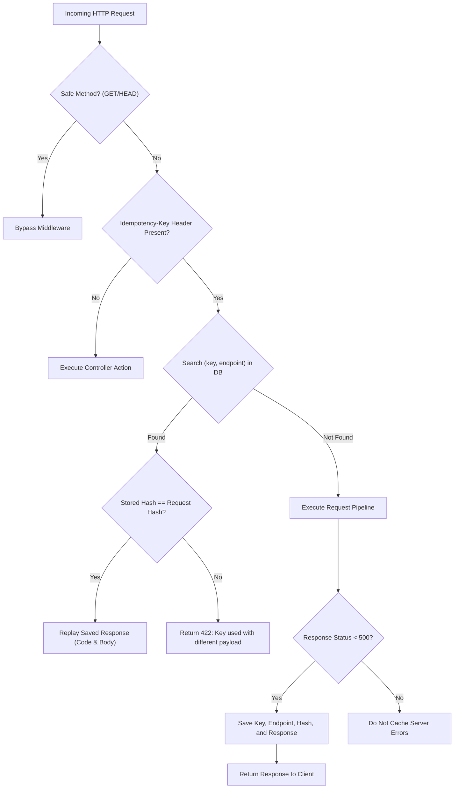

<p align="center">
  
</p>

# SlotSync

<p align="center">
  <strong>A concurrency-safe Laravel booking system with capacity management and idempotent reservations.</strong>
</p>

<p align="center">
  <a href="https://laravel.com"></a>
  <a href="https://php.net"></a>
  <a href="https://www.mysql.com"></a>
  <a href="https://pestphp.com"></a>
  <a href="https://github.com/Menna-Baligh/SlotSync/actions"></a>
  <a href="./LICENSE"></a>
</p>

---

## 📚 Quick Navigation

- [Overview](#overview)
- [Key Features](#key-features)
- [Tech Stack](#tech-stack)
- [Architecture & Request Flow](#architecture--request-flow)
- [Database Design](#database-design)
- [Reservation Lifecycle](#reservation-lifecycle)
- [Concurrency Strategy](#concurrency-strategy)
- [Idempotency](#idempotency)
- [API Reference](#api-reference)
- [API Examples](#api-examples)
- [Requirements](#requirements)
- [Installation & Setup](#installation--setup)
- [Running the Application](#running-the-application)
- [Testing](#testing)
- [Code Quality & CI](#code-quality--ci)
- [Project Structure](#project-structure)

---

## Overview

**SlotSync** is a reliable backend booking system built with Laravel. It allows users to reserve capacity for shared resources over specific time windows while preventing double-bookings and overbooking.

The system ensures that concurrent reservation requests never exceed available limits, handles network retries safely without creating duplicate bookings, and automatically tracks full audit history for every reservation change.

---

## Key Features

- **Concurrency-Safe Reservations**: Prevents overbooking when multiple users try to book the same resource at the same time.
- **Capacity Management**: Checks available units before creating, updating, or reducing resource capacity.
- **Idempotent Requests**: Prevents duplicate reservations when a client retries or resends a request due to network timeouts.
- **Reservation Expiration**: Automatically releases capacity held by pending reservations after a 2-minute hold window.
- **Reservation Lifecycle**: Manages clear status transitions between pending, confirmed, cancelled, and expired states.
- **Audit History**: Records changes and payloads whenever a reservation is created, updated, confirmed, cancelled, or expired.
- **Automated Testing & CI**: Includes a full suite of Pest tests running against MySQL in GitHub Actions, with code formatting via Laravel Pint.

---

## Tech Stack

| Technology | Purpose |
| :--- | :--- |
| **Laravel 13** | Backend PHP framework for routing, models, and validation |
| **PHP 8.3+** | Core programming language |
| **MySQL 8.0** | Relational database with InnoDB row-level locking support |
| **Pest 4** | Testing framework for unit and feature tests |
| **Laravel Pint** | Automated code style fixer and linter |
| **GitHub Actions** | Automated CI pipeline for testing and code styling |

---

## Architecture & Request Flow



---

## Database Design



---

## Reservation Lifecycle

Every reservation moves through a defined set of statuses:



### Status Rules

- **`PENDING`**: Consumes capacity while the reservation is within its 2-minute hold window. Once expired, it no longer consumes capacity.
- **`CONFIRMED`**: Consumes capacity permanently across its reserved time window.
- **`CANCELLED`**: Frees reserved capacity immediately.
- **`EXPIRED`**: Frees reserved capacity automatically when the hold time runs out.

---

## Concurrency Strategy

When multiple users try to reserve remaining units for the same resource simultaneously, a race condition can cause overbooking if both requests read the available capacity before either request writes.

SlotSync prevents this by using a database transaction with a row-level lock (`lockForUpdate()`) on the resource.



- Each reservation request locks the target resource row during evaluation.
- Competing requests wait until the active transaction commits or rolls back.
- When the next request runs, it reads the latest updated capacity, guaranteeing that overbooking cannot happen.

---

## Idempotency

Network glitches or timeouts often lead clients to retry requests. Without protection, retrying a booking request could create multiple duplicate reservations.

SlotSync includes an `IdempotencyMiddleware` that inspects the `Idempotency-Key` HTTP header on write requests (`POST`, `PUT`, `PATCH`):



- **Safe Retries**: If the same request is sent with the same key and payload, the stored response is returned immediately without re-executing business logic.
- **Payload Verification**: If the same key is reused with a different request payload, the request is rejected with `422 Unprocessable Entity`.
- **Database Unique Constraint**: A composite unique index on `(key, endpoint)` prevents duplicate keys from being created at the database level.

---

## API Reference

All write endpoints support the optional `Idempotency-Key` header.

| Method | Endpoint | Description |
| :--- | :--- | :--- |
| `POST` | `/api/reservations` | Create a pending reservation with a 2-minute hold. |
| `POST` | `/api/reservations/{reservation}/confirm` | Confirm an active pending reservation. |
| `POST` | `/api/reservations/{reservation}/cancel` | Cancel an active pending or confirmed reservation. |
| `PUT` | `/api/reservations/{reservation}` | Update units or time interval for an active reservation. |
| `GET` | `/api/reservations/{reservation}/history` | Retrieve the audit history for a reservation. |
| `PATCH` | `/api/resources/{resource}/capacity` | Update the total capacity of a resource. |

---

## API Examples

### 1. Create a Pending Reservation

**Request:**
```http
POST /api/reservations HTTP/1.1
Host: localhost:8000
Content-Type: application/json
Accept: application/json
Idempotency-Key: book-hall-001

{
  "resource_id": 1,
  "units": 2,
  "start_time": "2026-10-01 10:00:00",
  "end_time": "2026-10-01 11:00:00"
}
```

**Response (`201 Created`):**
```json
{
  "success": true,
  "message": "Pending reservation created successfully.",
  "data": {
    "id": 1,
    "resource_id": 1,
    "units": 2,
    "status": "PENDING",
    "start_time": "10:00:00",
    "end_time": "11:00:00",
    "expires_at": "10:02:00"
  }
}
```

---

### 2. Confirm a Reservation

**Request:**
```http
POST /api/reservations/1/confirm HTTP/1.1
Host: localhost:8000
Accept: application/json
Idempotency-Key: confirm-hall-001
```

**Response (`200 OK`):**
```json
{
  "success": true,
  "message": "Reservation confirmed successfully.",
  "data": {
    "id": 1,
    "resource_id": 1,
    "units": 2,
    "status": "CONFIRMED",
    "start_time": "10:00:00",
    "end_time": "11:00:00",
    "expires_at": null
  }
}
```

---

### 3. Update Resource Capacity

**Request:**
```http
PATCH /api/resources/1/capacity HTTP/1.1
Host: localhost:8000
Content-Type: application/json
Accept: application/json

{
  "capacity": 20
}
```

**Response (`200 OK`):**
```json
{
  "success": true,
  "message": "Resource capacity updated successfully.",
  "data": {
    "id": 1,
    "name": "Main Conference Room",
    "capacity": 20
  }
}
```

**Rejection when reduced below active bookings (`422 Unprocessable Entity`):**
```json
{
  "success": false,
  "message": "Cannot reduce capacity to 5. Active bookings require at least 7 units."
}
```

---

### 4. Get Reservation History

**Request:**
```http
GET /api/reservations/1/history HTTP/1.1
Host: localhost:8000
Accept: application/json
```

**Response (`200 OK`):**
```json
{
  "success": true,
  "message": "Reservation history retrieved successfully.",
  "data": [
    {
      "id": 1,
      "reservation_id": 1,
      "action": "CREATED",
      "old_payload": null,
      "new_payload": {
        "units": 2,
        "status": "PENDING",
        "start_time": "2026-10-01 10:00:00",
        "end_time": "2026-10-01 11:00:00",
        "expires_at": "2026-10-01 10:02:00"
      },
      "created_at": "2026-09-25 14:45:00"
    },
    {
      "id": 2,
      "reservation_id": 1,
      "action": "CONFIRMED",
      "old_payload": {
        "status": "PENDING",
        "expires_at": "2026-10-01 10:02:00"
      },
      "new_payload": {
        "status": "CONFIRMED",
        "expires_at": null
      },
      "created_at": "2026-09-25 14:46:15"
    }
  ]
}
```

---

## Requirements

- **PHP**: `^8.3` (Extensions: `pdo`, `pdo_mysql`, `bcmath`, `ctype`, `json`, `mbstring`, `tokenizer`, `xml`)
- **Composer**: `^2.x`
- **Database**: MySQL `8.0+` (or SQLite for testing)

---

## Installation & Setup

1. **Clone the repository:**
   ```bash
   git clone https://github.com/Menna-Baligh/SlotSync.git
   cd SlotSync
   ```

2. **Install dependencies:**
   ```bash
   composer install
   ```

3. **Set up environment configuration:**
   ```bash
   cp .env.example .env
   php artisan key:generate
   ```

4. **Configure your database in `.env`:**
   ```ini
   DB_CONNECTION=mysql
   DB_HOST=127.0.0.1
   DB_PORT=3306
   DB_DATABASE=slotsync
   DB_USERNAME=root
   DB_PASSWORD=
   ```

5. **Run migrations and seed default resources:**
   ```bash
   php artisan migrate --seed
   ```
   *Seeds default resources: Main Conference Room (10), Small Meeting Room (4), Training Hall (25), VIP Boardroom (6).*

---

## Running the Application

### 1. Start the API Server
```bash
php artisan serve
```
The API will be available at `http://127.0.0.1:8000`.

### 2. Run the Background Scheduler
To automatically clean up expired pending reservations every minute:
```bash
php artisan schedule:work
```

### 3. Run the Expiration Command Manually
```bash
php artisan reservations:expire
```

---

## Testing

SlotSync includes automated tests written with [Pest PHP](https://pestphp.com).

Run the tests using Artisan:
```bash
php artisan test
```

Or run Pest directly:
```bash
./vendor/bin/pest
```

### Covered Test Scenarios

| Test Suite | File | What It Tests |
| :--- | :--- | :--- |
| **Availability** | `tests/Feature/AvailabilityTest.php` | Full capacity booking, remaining capacity limits, adjacent non-overlapping bookings, and peak utilization across overlapping intervals. |
| **Capacity Updates** | `tests/Feature/CapacityUpdateTest.php` | Increasing resource capacity and rejecting capacity reductions below active booked units. |
| **Concurrency** | `tests/Feature/ConcurrencyTest.php` | Simulates two simultaneous requests competing for remaining units, verifying that only one succeeds. |
| **Expiration** | `tests/Feature/ExpiryAndRestartTest.php` | Rejects confirmation of overdue pending reservations and verifies the cleanup command marks them as expired. |
| **Idempotency** | `tests/Feature/IdempotencyTest.php` | Returns identical responses on repeated requests with the same key and rejects reuse of a key with modified payload. |
| **Lifecycle** | `tests/Feature/ReservationLifecycleTest.php` | Creates pending reservations, confirms them, frees capacity on cancellation, and updates reservation windows. |

---

## Code Quality & CI

The repository uses GitHub Actions for continuous integration:

1. **Automated Tests (`.github/workflows/tests.yml`)**:
   - Runs on push and pull requests to `main`, `master`, and `develop`.
   - Boots a **MySQL 8.0 service container** on Ubuntu.
   - Sets up PHP 8.3 and runs the complete Pest test suite.
2. **Code Style (`.github/workflows/pint.yml`)**:
   - Runs Laravel Pint on every push to check and auto-format PHP code.

---

## Project Structure

```text
SlotSync/
├── app/
│   ├── Console/
│   │   └── Commands/
│   │       └── ExpireReservationsCommand.php    # Artisan command to expire overdue holds
│   ├── Enums/
│   │   └── ReservationStatus.php               # PENDING, CONFIRMED, CANCELLED, EXPIRED
│   ├── Http/
│   │   ├── Controllers/Api/
│   │   │   ├── ReservationController.php       # Reservation API endpoints
│   │   │   └── ResourceController.php          # Resource capacity endpoint
│   │   ├── Middleware/
│   │   │   └── IdempotencyMiddleware.php       # Key check, SHA-256 hash & response cache
│   │   ├── Requests/
│   │   │   ├── StoreReservationRequest.php     # Validation for new reservations
│   │   │   ├── UpdateReservationRequest.php    # Validation for updating reservations
│   │   │   └── UpdateResourceCapacityRequest.php
│   │   └── Resources/
│   │       ├── ReservationHistoryResource.php  # Audit trail transformation
│   │       └── ReservationResource.php         # Reservation JSON transformation
│   ├── Models/
│   │   ├── IdempotencyKey.php                  # Stored idempotent responses
│   │   ├── Reservation.php                     # Reservation model
│   │   ├── ReservationHistory.php              # Audit trail model
│   │   └── Resource.php                        # Resource model
│   ├── Services/
│   │   ├── ReservationAvailabilityService.php  # Interval availability calculations
│   │   ├── ReservationService.php              # Transactional booking logic & locking
│   │   └── ResourceService.php                 # Capacity updates & peak checks
│   └── Traits/
│       └── ApiResponse.php                     # Standard JSON response helper
├── database/
│   ├── migrations/                             # Database schema & indexes
│   └── seeders/
│       ├── DatabaseSeeder.php
│       └── ResourceSeeder.php                  # Initial resource data
├── routes/
│   ├── api.php                                 # API route definitions
│   └── console.php                             # Scheduler: everyMinute sweeper
└── tests/
    └── Feature/                                # Feature tests (Availability, Concurrency, etc.)
```
